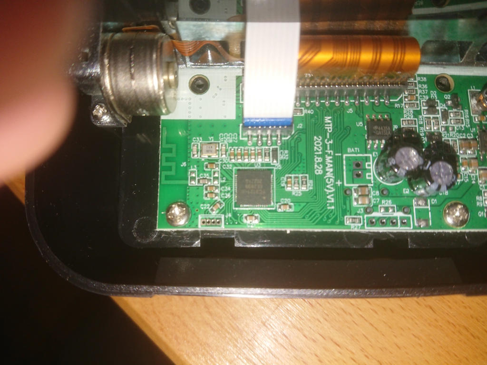

# Sudoku printer: Sudoku-printing thermal printer

[Simon Tatham's solo](https://www.chiark.greenend.org.uk/~sgtatham/puzzles/js/solo.html)
ported to a RP2040 & receipt printer.

https://user-images.githubusercontent.com/586911/209473091-9475dd75-24b3-457a-8cd4-e23bfe347af5.mp4

## Hardware

* A "Goojprt MTP-3F 80mm wireless thermal printer" from usual suspects
* A [Tiny 2040](https://shop.pimoroni.com/products/tiny-2040)
* A [10k linear pot](https://uk.rs-online.com/web/p/potentiometers/5220439)

The printer fortunately turned out to be very easy to hack. To open:-

* Remove 2 screws either side of the paper reel
* Remove 2 screws inside the battery compartment
* Gently pull the control panel ribbon cable out of it's socket

Inside there are 2 headers, both with ground & 3.3v power when the unit is on.
The leftmost header accepts 3.3v TTL serial input (at 115200 baud), the
rightmost seems to expose a GPIO (possibly to trigger paper cut hardware?)



The Tiny-2040 is definitely overkill, however it could definitely be powered
from 3.3v and had more chance of fitting inside the case. Turned out there's
loads of empty space inside the case around all sides, conveniently walled away
from any moving parts or paper. A much bigger dev board would have fitted if
needed.

The potentiometer acts as a difficulty control, choosing amongst the 6 solo
presets that make sense on a 9x9 grid. It also give something to mount the
Tiny-2040 onto.

### Assembly

The GND / 3.3v / TX / RX of the serial port are connected to ``3V`` / ``-`` / ``0`` / ``1`` of the Tiny-2040.

The potentiometer is attached to ``-`` / ``A0`` / ``A1`` of the Tiny-2040.

## Firmware

The vast majority of the code in this repository is lifted from [puzzles](https://git.tartarus.org/simon/puzzles.git) verbatim.
The custom code to work with the thermal printer is in [main.c](main.c).

A new game grid is generated with ``new_desc`` and ``new_game``, and then
a grid formatted using [ESC/POS](https://escpos.readthedocs.io/) is sent to the
printer. ESC/POS is a de-facto standard of VT100-like escape codes, enabling/disabling
various print styles.

There is no definitive documentation for the commands the printer
supports. The [CD it comes with has a haphazard selection of code samples](https://github.com/1rfsNet/GOOJPRT-Printer-Driver).
Most commands listed in other guides seem to work, but [Select Codepage](https://escpos.readthedocs.io/en/latest/font_cmds.html#select-codepage-1c-7d-26-rel)
seems non-functional, and I couldn't change it from Windows-1252.

### Build & upload

Build as-per any pico-sdk project:

```
export PICO_SDK_FETCH_FROM_GIT=1
(cd build && PICO_BOARD=pimoroni_tiny2040 cmake .. && make -j4)
```

Then hold down boot & copy ``build/sudokuprinter.uf2`` to the USB port.

## Bugs

The grid lines don't align perfectly. There are no line-drawing characters in
it's default code page, so the horizontal line is drawn as a bitmap, which
doesn't line up perfectly with the bold pipe characters in between.

The grid drawing has only been tested for a standard 9x9 grid, puzzle grids
might work, other forms of puzzle definitely won't. Especially given the above,
it would be easier long-term to print the whole grid as a bitmap, storing
number sprites in the RP2040.

# Appendix: ESC/POS references

Besides https://escpos.readthedocs.io/ which gets linked to in the source code, there's a few other vaguely-similar
printer programming manuals that were interesting:

* https://raw.githubusercontent.com/1rfsNet/GOOJPRT-Printer-Driver/main/Handheld%20PDA%20Q2/ESCPOS%20for%20printer.pdf
* https://www.able-systems.com/media/1798/40-mtp-series-programmer-guide.pdf
* https://download.brother.com/welcome/docp000584/cv_pt9700_eng_escp_103.pdf
* https://www.sparkag.com.br/wp-content/uploads/2016/06/ESC_POS-AK912-English-Command-Specifications-V1.4.pdf

And some other ESC/POS projects worth looking at:

* https://mike42.me/blog/tag/escpos
* https://github.com/python-escpos/python-escpos
* https://github.com/receipt-print-hq/escpos-printer-db
